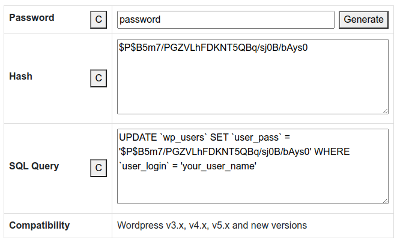

This plugin simply generates the wordpress hash password and user password update sql query.

## Installation

Download the zip file of the repository or clone the repository in your *wp-content/plugins*

1. Download the zip file

    As traditionally upload the plugin to your wordpress site and activate :smiley: .

    

2. Clone the repository
    
    ```git
    git clone git@github.com:sachinkiranti/wp-password-hash-generator.git
    ```
   
    Activate it!

## Usage

Add the shortcode to wordpress POST/PAGE or anywhere you want to :

```
[wp-password-hash-generator password="Password" hash="Hash" sql="SQL Query" compatibility="Compatibility" compatibilityValue="Wordpress v3.x, v4.x, v5.x and new versions" ]
```

The Output of the above shortcode :



## License
The Plugin is open-sourced software licensed under the [GNU license](LICENSE).

I would love if you could email me and tell me about your project and how this code was used, just for my own continued personal gratification :)